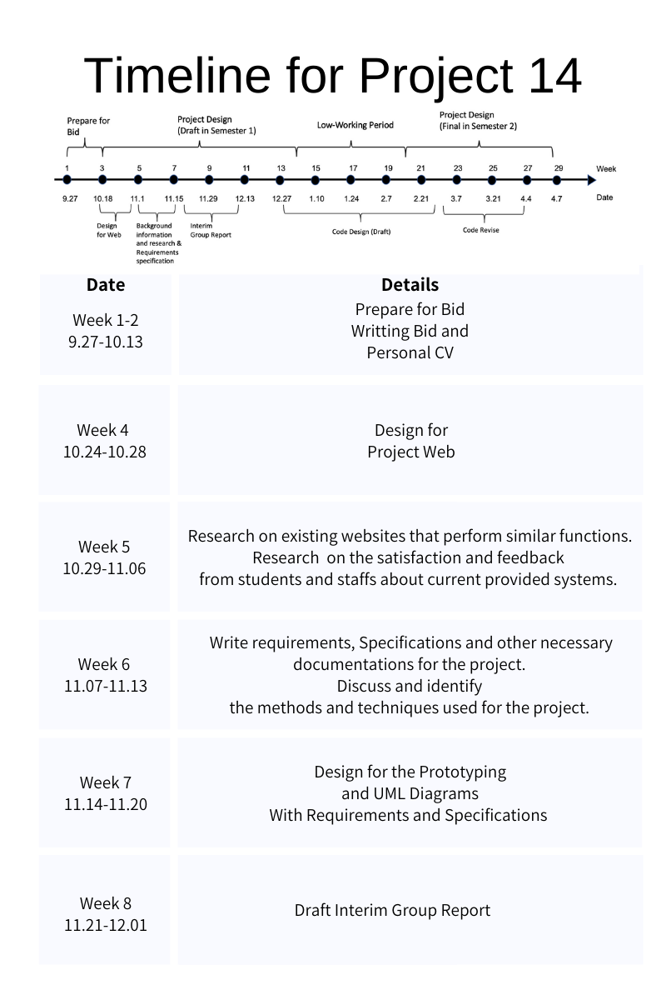
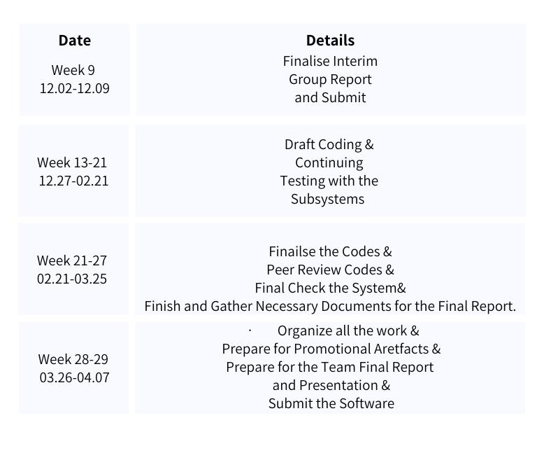

## Table of Content

[toc]

## Why Team 01 choose this project as first preference? 

As we do believe that computer science is to make life easier and better. 

In the nineteen seventies, the Xerox Corporation invented GUI, it was a great hit at that time. It enables people who might have  no idea of how computer works to make use it. Look around, with mouse, keyboard, user-friendly graphic interface, everyone, yes everyone could easily get used to computer and make use it to improve the working efficiency or entertain themselves with it. That is what computer science bring to the world, it makes everyone's life better. We do have reansons to believe that, in the future, more Human-computer interaction application would be required and invented. 

Back to this project, imagine that within one click, the project manager could arrange the job, check the ongoing events, check what is the resource need next or even motivate slacking employees. No more boring meetings, all the relevant info are presented just in front of the manager concisely and vividly. Everything is under control within one click. It is the same for the owner of the house/apartment. With his account, he could login the system and check the progress of decoration. Moreover he could follow it in WeChat and once a progress made, a piece of notification would sent to the owner. If anything goes wrong, owner could give feedback to the project manager via that system. This system do help the owner to follow the project and the manager to manage, control the project.

## Why choose Team01?

#### 	***Who are we?***

***Lead GUI Designer***: Yuanshi Wang (Johnny) & Yuhong Wei

- Who have rich relevant working experience concerning front-end development, and work together created a web page for a sea food company, which could help us to .
- Both have learned how to use uni-app to develop a WeChat applet at summer school at NUS.
- Both have good command of HTML, CSS, JavaScript.

***Editor & Repository Master***: Zixiang Hu (Zack)

- Who has lead his sophomore's FSE team and get 29 points(30 points in total) in the second group project.
- Who have rich experience in maintain the repo and good at editing the text content of a project.
- Who is the HTML Top Scorer in COMP1048 Databases and Interfaces 2020/21
- Whose average score for sophomore year is 84

***Quality Assurance Lead***: Ming Kai

- Who have go through half of the process of GRP and have experience in how to guarantee the success of our project.

***Technical Lead***: Yuzhe Zhang (Lok) & Yizhou Liu (Christina)

- Lok have working experience with other colleagues in one technical company on the design of WeChat applet, familiar with WeChat interface implementation. 
- Lok also have Diagnose and understand customers requirement quickly, deal with troubleshoot technology. 
- Lok experienced using IRON Python for better and more in-depth statistical analysis of data.
- Christina have

**Overall, as a team, we have 4 members who have experience in web development, and three of us have participated in WeChat applet development. Therefore, we are the group that has the ability to handle the project!**

#### 	***What is our plan?***

## Our understanding of the project

***Stakeholder Analysis:***

- Project manager/supervisor.
- Owner of the house/apartment.
- Resource provider?
- ...

***Target:*** 

- Monitor the progress of a project.
- Minimize the completion time of a project.

***Given:***

- The precedence relation between each project.
- Resource() to fulfill each task is known.

***Function required:***

- Track the status of each task in the project, including the completion status and resources preparation for each task.
- Present vividly the status of each project and each task in the project to the project manager through WeChat applet

- Accurately recording and tracking each task’s completion status is vital for the completion of the entire project.
- Multiuser with different functionality and permission.
- Vision-based techniques will be used to present the status of a project completion for different users.

In the system, a network fixed project plan (PP) is given. ?????

Some statistic results should be exhibited in hierarchical detail levels?????

## Appendix 

#### 1. Team01's repo: 

[Click here to view our repo](https://csprojects.nottingham.edu.cn/scyzh6/team202101)

Some screenshot below

#### 2. Team01 member's CV
 - [YuzheZhang's CV](CV/CV_YuzheZhang.pdf)
 - [YizhouLiu's CV](CV/CV_YizhouLiu.pdf)
 - [YuhongWei's CV](CV/CV_YuhongWei.pdf)
 - [YuanshiWang's CV](CV/CV_YuanshiWang.pdf)

#### 3. Informal meeting's minutes and agenda

- **Minutes:**
  - [Minutes_Oct01](Minutes/Minutes_Oct01.pdf)
  - [Minutes_Sep29](Minutes/Minutes_Sep29.pdf)

- **Agenda:**
  - [Agenda_Sep29](Agendas/Agenda_Sep29.pdf)

