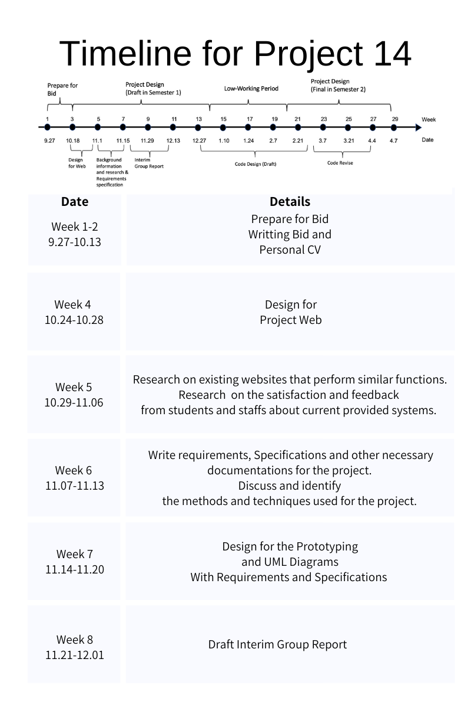
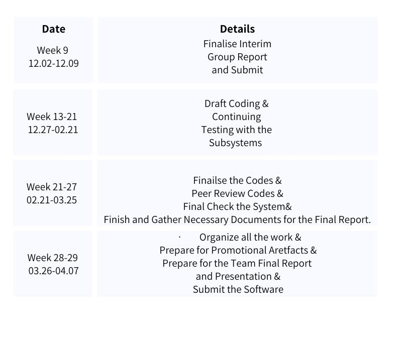
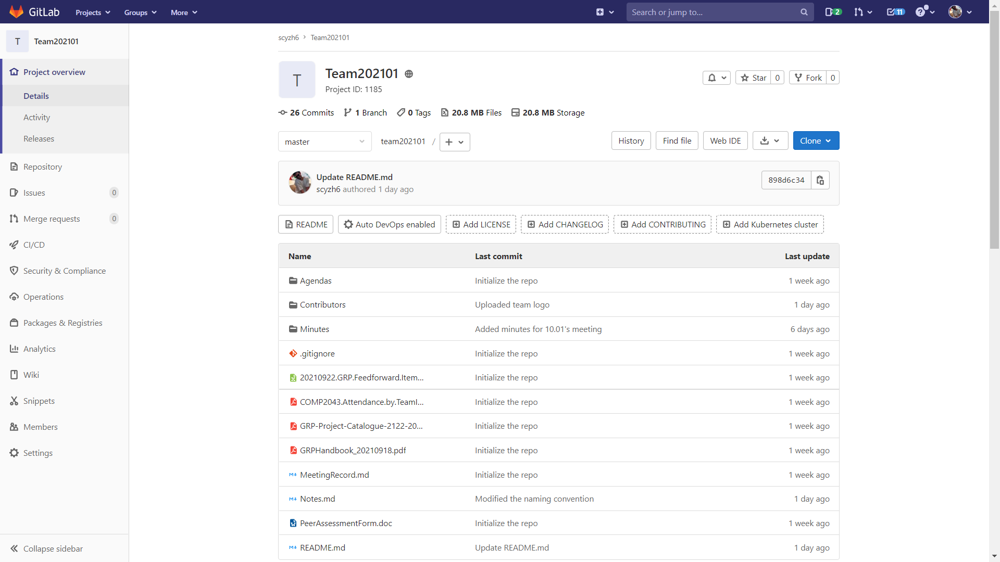
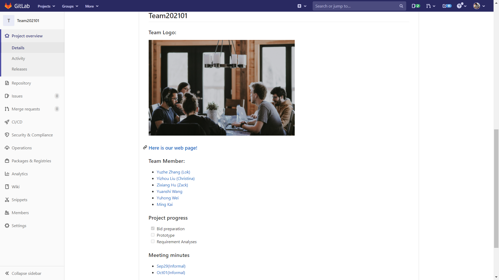

## Table of Content

[toc]

## Why Team 01 choose this project as first preference? 

As we do believe that computer science is to make life easier and better. 

In the nineteen seventies, the Xerox Corporation invented GUI, it was a great hit at that time. It enables people who might have  no idea of how computer works to make use it with click on mouse. Look around, with mouse, keyboard, user-friendly graphic interface, everyone, yes everyone could easily get used to computer and make use it to improve the working efficiency or entertain themselves with it. That is what computer science bring to the world, that is: making everyone's life better. We do have reasons to believe that, in the future, more Human-computer interaction application would be required and invented. As they 

Back to this project, imagine that within one click, the project manager could arrange the job, check the ongoing events, check what is the resource need next or even motivate slacking employees. No more sitting in one room having boring meeting, all the relevant info are presented just in front of the manager concisely and vividly. Everything is under control within one click. It is the same for the owner of the house/apartment. With his account, he could login the system and check the progress of decoration. Moreover he could follow it in WeChat and once a progress made, a piece of notification would sent to the owner. If anything goes wrong, owner could give feedback to the project manager via that system. This system do help the owner to follow the project and the manager to manage, control the project. From our standpoint, that is what the future software would be like. Thus we do favour this project.

## Why choose Team01?

#### 	***Who are we?* ** (Roles would change all along with process)

***Lead GUI Designer***: Yuanshi Wang (Johnny) & Yuhong Wei

- Who have rich relevant working experience concerning front-end development, and work together created a web page for a sea food company, which could help us to .
- Both have learned how to use uni-app to develop a WeChat applet at summer school at NUS.
- Both have good command of HTML, CSS, JavaScript.

***Editor & Repository Master***: Zixiang Hu (Zack)

- Who has lead his sophomore's FSE team and get 29 points(30 points in total) in the second group project.
- Who have rich experience in maintain the repo and good at editing the text content of a project.
- Who is the HTML Top Scorer in COMP1048 Databases and Interfaces 2020/21.
- Whose average score for sophomore year is 84.
- Who attend the Fose Innovation Lab dealing with natural language processing. Deployed BERT and reached 96% average accuracy in categorizing input sentence.

***Quality Assurance Lead***: Ming Kai

- Have one semester GRP experience to ensure project progress
- Have certain programming ability to give appropriate suggestions

***Technical Lead***: Yuzhe Zhang (Lok) & Yizhou Liu (Christina)

- Lok have working experience with other colleagues in one technical company on the design of WeChat applet, familiar with WeChat interface implementation. 

- Lok also have Diagnose and understand customers requirement quickly, deal with troubleshoot technology. 

- Lok experienced using IRON Python for better and more in-depth statistical analysis of data.

  

- Christina has working experience in data mining and applet development, who has an internship about data type transformation and data processing.

- Christina has worked with a project group about Bluetooth connection and machine operation, gaining experience in OpenCV operation. 

**Overall, as a team, we have 4 members who have experience in web development, and three of us have participated in WeChat applet development. Therefore, Team01 is the group that has the ability to handle the project!**

#### 	***What is our plan?***

Below is an estimate timeline for guiding/reminding us through this project. From our standpoint, the autumn semester we would mainly focus on requirement gathering and UML diagrams plotting, as these things are the main reference when we start coding. If these doc is detailed and well written, the process of coding would be smoother.

## Our rough understanding of the project

#### ***Rough Stakeholder Analysis:***

- Primary Stakeholders:
  - Project manager/supervisor.
  - Owner of the house/apartment.
  - ...

- Secondary Stakeholders:
  - Resource provider(Might be).
  - ...

#### ***Basic Functionality required:***

- From system's view:

  - Allow multiuser login with different permission and UI.

  - Provide WeChat-based interface for stakeholder.

  -  Exhibit statistic results in hierarchical detail levels.

    

- From project manager's view:

  - Accurately recording and tracking each task’s completion status

  - Urging the resource provider through system offering channel

  - Assigning job to a specific group member.

    

- From home owner's view:

  - Present vividly the status of each project and each task in the project to the project manager through WeChat applet
  - View statistic results in hierarchical detail levels.
  - Urging the project manager through system offering channel

#### ***Some questions/hypothesis over this system:***

- "In the system, a network fixed project plan (PP) is given. "  
  - What this "network fixed project plan (PP)" refers to? Could we consider it as the input project plan in a default format (follow some protocol), so according to that PP, this system would expend and visualize it to user.

- "Some statistic results should be exhibited in hierarchical detail levels."
  - Which means that in the system, maybe one or more pages would display the statistic results in hierarchical detail levels. However, what this hierarchical detail level refers to, could we explain it as a more complex way to show the detail rather than display with a plain graph, maybe we need more instruction on how to do this.
  - Moreover, could we consider the "statistic results" refers to something like: numbers of task finished this week, the average consuming time of each task, the total cost of this decoration project up to right now...

## Appendix 

#### 1. Team01's repo: 

[Click here to view our repo](https://csprojects.nottingham.edu.cn/scyzh6/team202101)

Some screenshot below

#### 2. Team01 member's CV

- [ZixiangHU's CV](CV/CV_ZixiangHu.pdf)

 - [YuzheZhang's CV](CV/CV_YuzheZhang.pdf)
 - [YizhouLiu's CV](CV/CV_YizhouLiu.pdf)
 - [YuhongWei's CV](CV/CV_YuhongWei.pdf)
 - [YuanshiWang's CV](CV/CV_YuanshiWang.pdf)
 - [MingKai's CV](CV/CV_MingKai.pdf)

#### 3. Informal meeting's minutes and agenda

- **Minutes:**

  * [Minutes_Oct10](Minutes/Minutes_Oct10.pdf)

  - [Minutes_Oct01](Minutes/Minutes_Oct01.pdf)
  - [Minutes_Sep29](Minutes/Minutes_Sep29.pdf)

- **Agenda:**
  - [Agenda_Sep29](Agendas/Agenda_Sep29.pdf)

