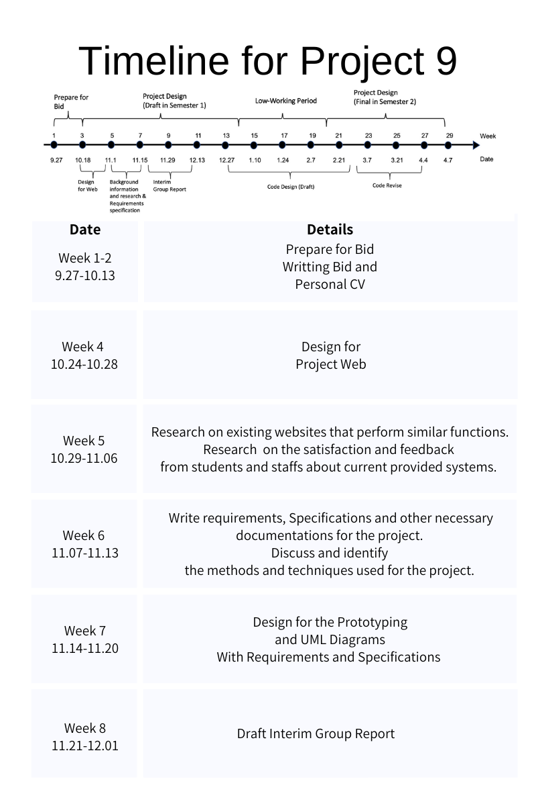
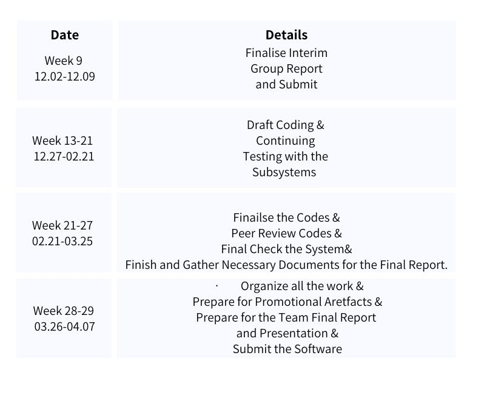
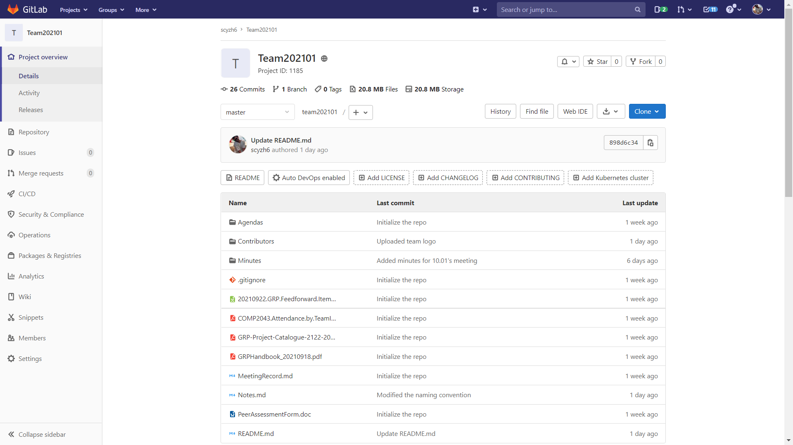
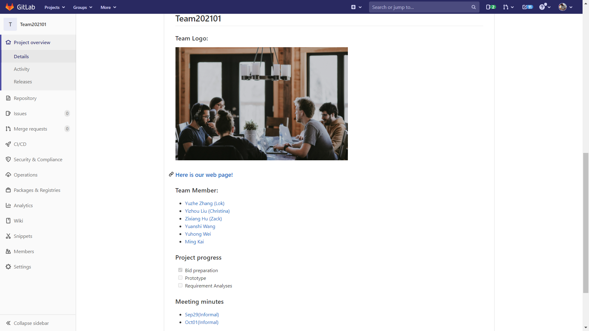

## Bid Preference 3: Project[P19] Surveillance Video Analysis Toolbox

## Table of Content

[toc]

## Why Team 01 choose this project as third preference? 

Ningbo‐Zhoushan Port is the world‐leading port in Ningbo. Hence it is significant to surveillant the operations in the port and monitor the daily operations. With the recent developments in computer vision and machine learning, analyzing surveillance videos and un‐ derstanding the content of the video becomes feasible. We do have reansons to believe that, we can develop and implement a surveillance video analysis toolbox to ensure the safety of Zhoushan Port.

To be honest, this project extremely attracted me when I browsed the overview. I realized that this is a challenging but quite interesting project. It is closely related to Ningbo,  where I live and study.  I feel like making a contribution to this prosperous port city. In addition, this is a comprehensive project, which request knowledge in more than one area and good cooperation in a software development team. I convinced that every member in our team will gain a lot, including programming skills, the method of work as a team and so on, when this course finishs.

## Why choose Team01?

#### 	***Who are we?***

***Lead GUI Designer***: Yuanshi Wang (Johnny) & Yuhong Wei

- Who have rich relevant working experience concerning front-end development, and work together created a web page for a sea food company, which could help us to .
- Both have learned how to use uni-app to develop a WeChat applet at summer school at NUS.
- Both have good command of HTML, CSS, JavaScript.

***Editor & Repository Master***: Zixiang Hu (Zack)

- Who has lead his sophomore's FSE team and get 29 points(30 points in total) in the second group project.
- Who have rich experience in maintain the repo and good at editing the text content of a project.
- Who is the HTML Top Scorer in COMP1048 Databases and Interfaces 2020/21
- Whose average score for sophomore year is 84

***Quality Assurance Lead***: Ming Kai

- Have one semester GRP experience to ensure project progress. 
- Have certain programming ability to give appropriate suggestions.

***Technical Lead***: Yuzhe Zhang (Lok) & Yizhou Liu (Christina)

- Lok have working experience with other colleagues in one technical company on the design of WeChat applet, familiar with WeChat interface implementation. 
- Lok also have Diagnose and understand customers requirement quickly, deal with troubleshoot technology. 
- Lok experienced using IRON Python for better and more in-depth statistical analysis of data.
- Christina has working experience in data mining and applet development, who has an internship about data type transformation and data processing.
- Christina has worked with a project group about bluetooth connection and machine operation, gaining experience in OpenCV operation. 

**Overall, as a team, we have 4 members who have experience in web development, and three of us have participated in WeChat applet development. Therefore, we are the group that has the ability to handle the project!**

#### 	***What is our plan?***

## Our understanding of the project

***Stakeholder Analysis:***

- Project manager/supervisor.
- Owner of the house/apartment.
- Resource provider?
- ...

***Target:*** 

- Surveillant the operations in the port and monitor the daily operations
- Detect and track people and vehicles, recognize faces and gaits, and detect unusual dangerous events

***Given:***

- The precedence relation between each project.
- Resource() to fulfill each task is known.
- The contents of toolkit.

***Function required:***

- Track the status of each task in the project, including the completion status and resources preparation for each task.
- Present vividly the status of each project and each task in the project to the project manager through WeChat applet

- Accurately recording and tracking each task’s completion status is vital for the completion of the entire project.
- Multiuser with different functionality and permission.
- Vision-based techniques will be used to present the status of a project completion for different users.

In the system, a network fixed project plan (PP) is given. 

Some statistic results should be exhibited in hierarchical detail levels.

## Appendix 

#### 1. Team01's repo: 

[Click here to view our repo](https://csprojects.nottingham.edu.cn/scyzh6/team202101)

Some screenshot below

#### 2. Team01 member's CV
 - [YuzheZhang's CV](CV/CV_YuzheZhang.pdf)
 - [YizhouLiu's CV](CV/CV_YizhouLiu.pdf)
 - [YuhongWei's CV](CV/CV_YuhongWei.pdf)
 - [YuanshiWang's CV](CV/CV_YuanshiWang.pdf)

#### 3. Informal meeting's minutes and agenda

- **Minutes:**

  * [Minutes_Oct10](Minutes/Minutes_Oct10.pdf)

  - [Minutes_Oct01](Minutes/Minutes_Oct01.pdf)
  - [Minutes_Sep29](Minutes/Minutes_Sep29.pdf)

- **Agenda:**
  
  - [Agenda_Sep29](Agendas/Agenda_Sep29.pdf)

#### 
