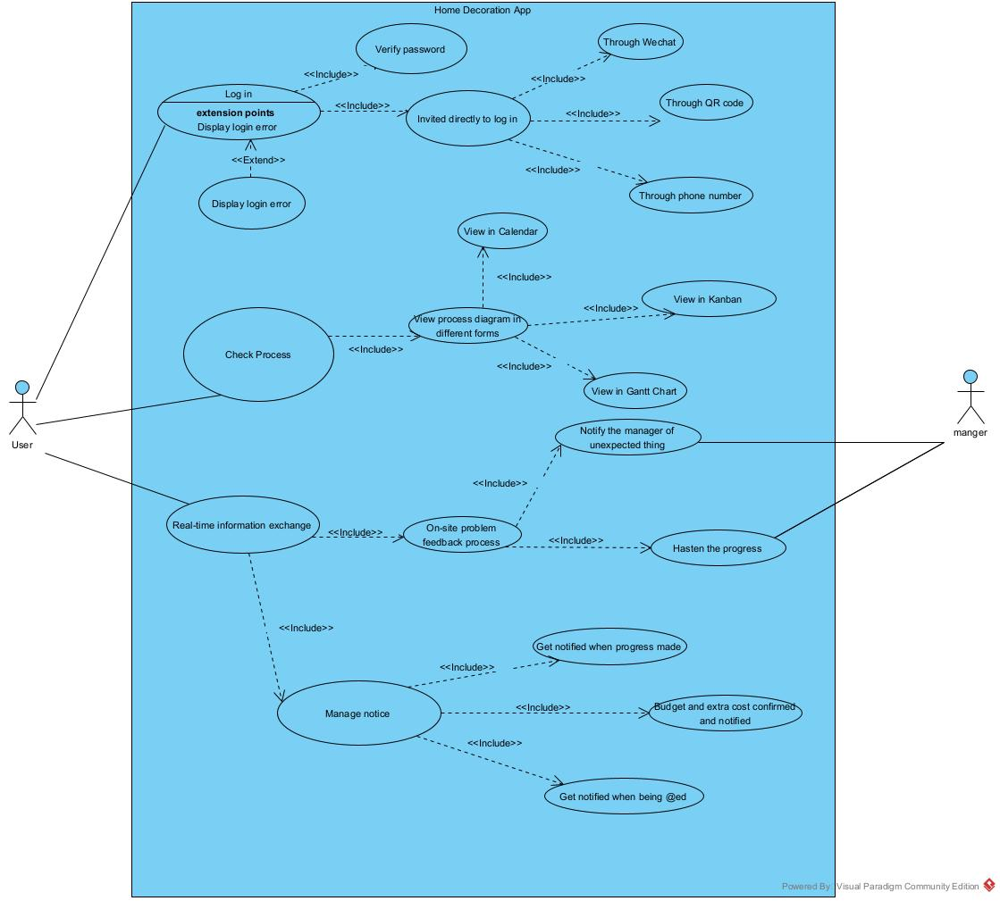
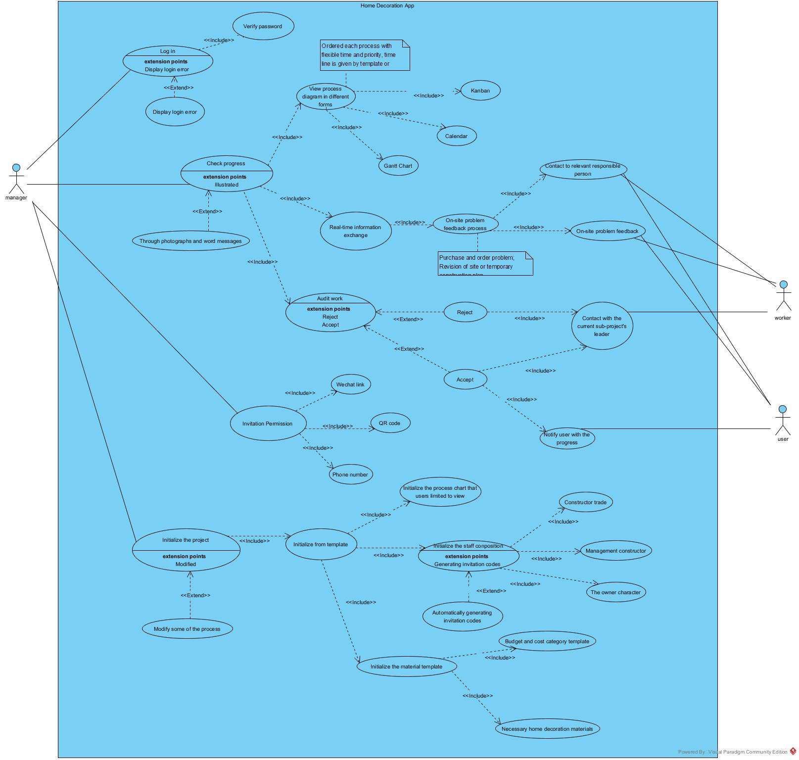

## Requirement specification document

### Requirement list(currently list, further table would be made)

#### Functional Requirements

##### House Owner

- Functional 

##### Project Manager

- 

##### Worker

- 

##### Admin

- 

#### Non-functional requirements

##### Safety Requirements

- Backup, recovery
- Concurrency

##### Security Requirements

- Account ID and Password(PIN) Protection
- Auto 
- Sign-off Button
- Failed Log-on Attempts
- Encryption

##### Software Quality Attributes

- 

### Use case diagram for the project from the view of different stakeholder

##### House Owner

##### Project Manager

##### Worker

##### Admin

### Further Question about the Requirement gathering/validation

### How we gathered the requirements?

**Methodology:**

1. Online researching 
2. search for paper

### How we validated these requirements?

First, internal check, group check, talk about the graph(use case diagram) design,could they be put together and have no conflicts.

Second, list the 1st version of requirement document and go through with the stakeholder piece by piece.

### Why just use case diagram but not user story\scenario?

what we have to agree on is that, our connection with the actual Engineering team is rather weak, as we did not sign the full ethical approval sheet, we can not get in touch with them directly. All the information we gathered is transferred by our supervisor, which does slowed down our progress(once a week, but we could contact through mail, we should do more).

User Requirement: what a stakeholder need to be able to do.

System specification: what the software must do to meet the requirement above.

Functional: 

- Functions that the user needs to achieve(as requirement) e.g. allow login, display profile information,
- Functions the software will include(as specification)

Non-functional:

- Constraints on what the user needs to do(as requirements) e.g. Up time, security standards, number of concurrent users,

From user requirement to system specification

According to the stakeholder write user requirement:

- 

Requirement elicitation (how we elicit the requirement from stakeholder)

1. firstly, by simulating that if we are in that condition, what would we expect the system should work like. Then check these requirement with the actual stakeholder through our supervisor. So we should provide a list of requirement and 

1. 

